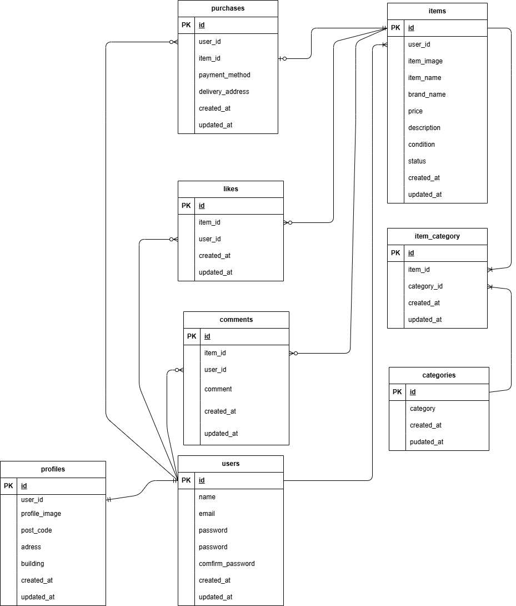

# README.md

# 模擬テスト フリマアプリ

# プロジェクト名: frea-market

GitHubリポジトリURL: [git@github.com:oxnut134/frea-market.git](mailto:git@github.com:oxnut134/frea-market.git)

---

# 1）環境構築

### 1-1 開発環境

### 必要ファイル作成

- **ディレクトリ構築**
- **以下のファイルを作成**
    - docker-compose.yml
    - default.conf
    - Dockerfile
    - php.ini
    - my.cnf

### Dockerビルド

```css
コピー
docker-compose up -d --build

```

### PHPコンテナログイン

```bash
コピー
docker-compose exec php bash

```

### Composerインストール確認

```
コピー
composer -v

```

### Laravelインストール

```lua
コピー
composer create-project "laravel/laravel=8.*" . --prefer-dist

```

### 日本時間に変更

### Laravel起動確認

- ブラウザで `http://localhost` にアクセス

### エラー発生時の対応

```bash
コピー
chmod -R 775 storage
chown -R www-data storage

```

---

### 1-2 Database

### MySQLコンテナログイン

```bash
コピー
docker-compose exec mysql bash

```

### MySQL起動

```css
コピー
mysql -u laravel_user -p

```

- **パスワード入力**

### Database確認

```
コピー
show databases;

```

### `.env`ファイル編集

```
コピー
DB_CONNECTION=mysql
DB_HOST=mysql
DB_PORT=3306
DB_DATABASE=laravel_db
DB_USERNAME=laravel_user
DB_PASSWORD=laravel_pass

```

---

### 1-3 マイグレーション

### マイグレーション実行

```
コピー
php artisan migrate

```

### 実行順（参考）

1. **2014_09_30_000001_create_users_table.php**→ 2019年に隠れファイルが存在し、`migrate`で`users`テーブルがないとエラーが発生するため、2014年の日付に変更。
2. **2025_07_08_000104_create_items_table.php**
3. **2025_07_08_000108_create_categories_table.php**
4. **2025_07_08_000112_create_profiles_table.php**
5. **2025_07_08_000120_create_likes_table.php**
6. **2025_07_08_000124_create_comments_table.php**
7. **2025_07_08_000140_create_item_category_table.php**
8. **2025_07_09_073407_create_add_nullable_brand_building_table.php**→ 上書き用
9. **2025_07_09_073410_create_add_nullable_status_table.php**→ 上書き用
10. **2025_07_09_073420_create_purchases_table.php**

---

### 1-4 シーディング

### シーディング実行

```
コピー
php artisan db:seed

```

### 実行対象

- **ItemsTableSeeder**
- **CategoriesTableSeeder**

---

### 1-5 Mailhog設定

### `.env`ファイル編集

```
コピー
MAIL_MAILER=smtp
MAIL_HOST=mailhog
MAIL_PORT=1025
MAIL_USERNAME=null
MAIL_PASSWORD=null
MAIL_ENCRYPTION=null
MAIL_FROM_ADDRESS=admin@test.com
MAIL_FROM_NAME="${APP_NAME}"

```

---

### 1-6 Stripe設定

### `.env`ファイル編集

```
コピー
STRIPE_PUBLIC_KEY={公開可能キー}
STRIPE_SECRET_KEY={シークレットキー}

```

### `config/services.php`に追記

```bash
コピー
'stripe' => [
    'public_key' => env('STRIPE_PUBLIC_KEY'),
    'secret_key' => env('STRIPE_SECRET_KEY'),
],

```

### Laravel Cashierインストール

```bash
コピー
composer require laravel/cashier

```

---

### テストコード

**①会員登録機能　　　　RegisterValidationTest.php
②ログイン機能　　　　LoginValidationTest.php**
③**ログアウト機能　　　LogoutValidationTest.php
④商品一覧取得　　　　IndexFunctionTest.php
⑤マイリスト一覧取得　MylistFunctionTest.php
⑥商品検索機能　　　　SearchItemsTest.php
⑦商品詳細情報取得　　ShowItemDetailTest.php
⑧いいね機能　　　　　LikeFunctionTest.php
⑨コメント送信機能　　CommentFunctionTest.php
⑩商品購入機能　　　　PurchaseFunctionTest.php
⑪支払い方法選択機能　PaymentMethodDisplayedTest.php
⑫配送先変更機能　　　RedirectDeliveryAddressTest.php
⑬ユーザー情報取得　　MyPageFunctionTest.php
⑭ユーザー情報変更　　MyProfileDisplayedTest.php
⑮出品商品情報登録　　RegisterForExhibitionTest.php**

# 2）利用技術

- **Docker**: 27.5.1
- **PHP**: 7.4.9
- **MySQL**: 8.0.26
- **Nginx**: 1.21.1
- **phpMyAdmin**
- **Laravel Framework**: 8.75
- **Laravel Fortify**: 1.19
- **Mailhog**: latest
- **Stripe/stripe-php**: 9.9

---

# 3）ER図



---

# 4）URL

- **開発環境**: [http://localhost/](http://localhost/)
- **Laravel公式ドキュメント**: [Laravel Fortify - Laravel 12.x](https://laravel.com/docs/12.x/fortify)
- **Mailhog**: [https://github.com/mailhog/MailHog](https://github.com/mailhog/MailHog)
- **Stripe公式サイト**: [https://stripe.com/jp](https://stripe.com/jp)
- **Stripe Checkout作成例**: [https://zakkuri.life/laravel-stripe-charge/](https://zakkuri.life/laravel-stripe-charge/)※APIが以前のもので3DS未対応のため、新しいAPIにする必要あり。