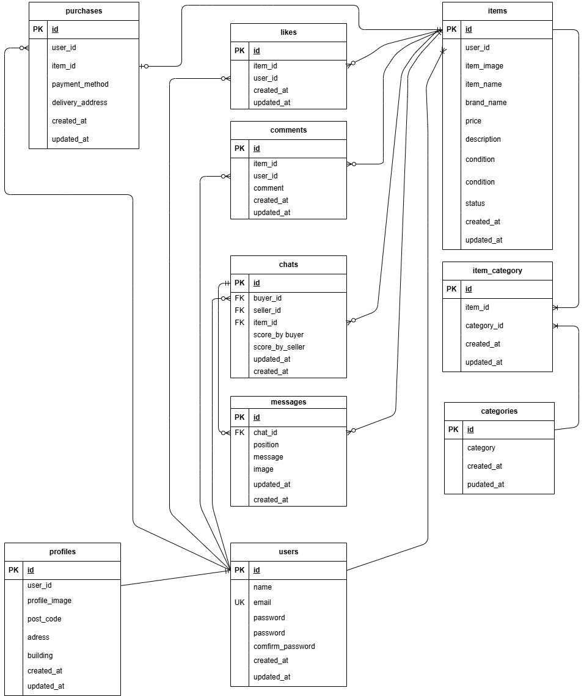

# README

# README.md

# Pro入会テスト_フリマアプリ

# プロジェクト名: pro-test

GitHubリポジトリURL: [git@github.com:oxnut134/pro-test.git](mailto:git@github.com:oxnut134/frea-market.git)

---

# 1）環境構築

### 1-1 開発環境

### 必要ファイル作成

- **ディレクトリ構築**
- **以下のファイルを作成**
    - docker-compose.yml
    - default.conf
    - Dockerfile
    - php.ini
    - my.cnf

### Dockerビルド

```css
docker-compose up -d --build
```

### PHPコンテナログイン

```bash
docker-compose exec php bash
```

### Composerインストール確認

```

composer -v

```

### Laravelインストール

```lua
composer create-project "laravel/laravel=8.*" . --prefer-dist
```

### 日本時間に変更

`config/app.php　　'timezone' => 'Asia/Tokyo'`

### .env確認

　.envファイルがあるか確認し、なければ作成

### APP_KEY作成

`php artisan key:generate` 

### Laravel起動確認

- ブラウザで `http://localhost` にアクセス

### エラー発生時の対応

```jsx
chmod -R 775 storage
chown -R www-data storage
```

---

### 1-2 Database

### MySQLコンテナログイン

```bash
docker-compose exec mysql bash
```

### MySQL起動

```css
mysql -u laravel_user -p
```

- **パスワード入力**

### Database確認

```
show databases;

```

### `.env`ファイル編集

```
DB_CONNECTION=mysql
DB_HOST=mysql
DB_PORT=3306
DB_DATABASE=laravel_db
DB_USERNAME=laravel_user
DB_PASSWORD=laravel_pass

```

```
docker-compose up -d --build
```

### 1-3 マイグレーション

### マイグレーション実行

```
php artisan migrate

```

### 1-4 シーディング

### シーディング実行

```
php artisan db:seed

```

### 実行対象

実行されるのは以下の３シーダーです。

- **UsersTableSeeder**※１
- **ItemsTableSeede**r
- **CategoryTableSeeder**
- **ChatsTableSeeder**
- **MessagesTableSeeder**

  ****※１   passwordはabc12345となっております。

　****
      

---

### 1-5 Mailhog設定

### `.env`ファイル編集

```
MAIL_MAILER=smtp
MAIL_HOST=mailhog
MAIL_PORT=1025
MAIL_USERNAME=null
MAIL_PASSWORD=null
MAIL_ENCRYPTION=null
MAIL_FROM_ADDRESS=admin@test.com
MAIL_FROM_NAME="${APP_NAME}"

```

---

# 2）利用技術

- **Docker**: 27.5.1
- **PHP**: 7.4.9
- **MySQL**: 8.0.26
- **Nginx**: 1.21.1
- **phpMyAdmin**
- **Laravel Framework**: 8.75
- **Laravel Fortify**: 1.19
- **Mailhog**: latest

---

# 3）ER図

---



# 4）URL

- **開発環境**: [http://localhost/](http://localhost/)
- **Laravel公式ドキュメント**: [Laravel Fortify - Laravel 12.x](https://laravel.com/docs/12.x/fortify)
- **Mailhog**: [https://gitub.com/mailhog/MailHog](https://github.com/mailhog/MailHog)

# 5）追記事項

①今回実装分は下記と通りです。

・web.php　ファイル末尾　　

```
Route::get('/chat/{item_id}', [UserController::class, 'chat'])->name('chat');
Route::post('/post', [UserController::class, 'post'])->name('post');

```

- view

　chat.blade.php（新規）
　modal.blade.php（新規　publicディレクトリ直下に配置）
　mypage.blade.php（修正）

- メソッド（UserController.php）

　getTransactionItems（新規）
　chat（新規）
　post（新規）
　myPage（修正）
　getProfile（修正）
　getPurchasedItems（修正）
　getExhibitedItems（修正）

　

②ユーザーpasswordはabc12345になっております。